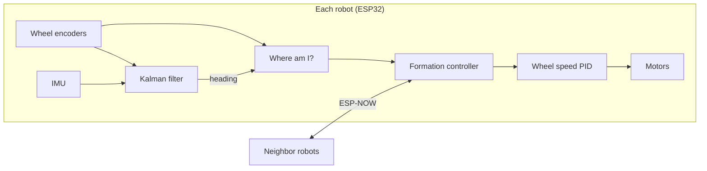

# 🤖 multi-robot-formation-control

Three small robots we built that arrange themselves into a shape by talking to each other. There's no master computer in charge: each robot only listens to its neighbors and decides its own moves.

This was my graduation project at Sultan Qaboos University (2026), built as a two-person team.

<!-- Drop your demo video or GIF here -->


https://github.com/user-attachments/assets/da3cd984-d966-41d4-9e37-92a87bac95dd

<p align="center">
  
</p>

---

## 💡 The Idea

Most multi-robot systems have one central computer telling everyone where to go. That works until the computer crashes, and then everything stops.

We wanted the opposite: every robot runs its own controller, shares its position with its neighbors over wireless, and adjusts itself. If you think of the robots as dots and the communication links as lines, you get a **graph**, and graph theory tells you how many links you need so the shape can't wobble or collapse.

---

## ⚙️ How It Works



### 1. Keeping the shape: distance-based control
Instead of giving each robot a fixed spot on the floor, we only tell it how far it should be from each neighbor. The robot moves along each link to shrink whatever distance error it sees:

$$u_i = k_p \sum_{j \in \mathcal{N}_i} \left( \lVert p_j - p_i \rVert - d_{ij} \right)\frac{p_j - p_i}{\lVert p_j - p_i \rVert}$$

In practice the corrections are averaged over the active links, and there's a 4 mm deadband so the robots settle down instead of jittering around the target.

The nice part is that the formation can end up anywhere and in any orientation. Only the shape matters.

We picked this approach after comparing it with position-based control (needs a global map) and displacement-based control (all robots must agree on the same "north").

### 2. Turning that into wheel commands
The control law gives a direction to move in, but a two-wheeled robot can't slide sideways. So we control a point 5 cm in front of the wheel axle instead of the axle itself. That point *can* move in any direction, and it gives a clean mapping to forward speed and turn rate:

$$v = u_x\cos\theta + u_y\sin\theta, \qquad \omega = k_\omega\,\frac{-u_x\sin\theta + u_y\cos\theta}{L}$$

Then $v$ and $\omega$ are split into left and right wheel speeds ($v \mp \tfrac{W}{2}\omega$), with acceleration limits so the robots start and stop smoothly.

### 3. Making sure the shape can't bend
A square with only four sides can squish into a diamond while keeping every side length the same. To prevent that, the graph has to be **rigid**. In 2D, a group of `n` robots needs at least `2n − 3` links. For three robots that's 3 links, which is exactly a triangle where everyone talks to everyone.

### 4. Knowing where each robot is
There's no GPS or camera. Each robot tracks itself by counting wheel rotations (odometry):

$$\Delta s = \frac{\Delta s_L + \Delta s_R}{2}, \qquad x \mathrel{+}= \Delta s \cos\theta, \qquad y \mathrel{+}= \Delta s \sin\theta$$

The tricky part is the heading angle θ. Encoders drift when wheels slip, and the IMU is noisy, so we fused both with a **Kalman filter** (Q = 0.0001, R = 0.01): the encoder turn rate drives the prediction, and the IMU angle corrects it. The result is smoother than either sensor alone. (One catch: the MPU6050 has no magnetometer, so its angle is also integrated from the gyro. Fusion reduces noise, but slow drift is still there.)

### 5. Driving the wheels
Each wheel has its own PID speed loop (Kp = 9.25, Ki = 1.0, Kd = 0.33, tuned by hand on the real robot). The encoder speed signal was noisy, so we smoothed it with a first-order low-pass filter (τ = 80 ms) before feeding it to the PID. The N20 gearboxes won't move below a certain PWM, so small commands get bumped up to a minimum duty cycle to beat static friction.

### 6. Talking to each other
The robots use **ESP-NOW**, which lets ESP32 boards message each other directly without a Wi-Fi router. Each robot sends its position 20 times a second, and only to its neighbors in the graph.

### 7. Running it all at once
The firmware runs on **FreeRTOS** with separate tasks for sensing (100 Hz), control (100 Hz), and communication (20 Hz), with mutexes protecting the shared data. There's also a safety rule: if a robot stops hearing from any of its neighbors for a second, or its own sensor data goes stale, it stops moving.

---

## 🔩 The Hardware

All the mechanical parts are 3D printed in PLA. Each robot is about 10 × 10 cm.

The chassis is based on the open-source [Pancake ESP32 Robot](https://grabcad.com/library/pancake-esp32-robot-for-mapping-and-slam-1) design from GrabCAD, shared for non-commercial use. We modified it for our build: straight motor mounts, AS5600 encoder mounts, standard M2 screw holes, and a reshaped internal edge to protect the wiring.

- **Brain:** ESP32 LOLIN D32
- **Motors:** N20 metal gear motors (3 V, 60 RPM)
- **Encoders:** AS5600 magnetic encoders, with the magnet embedded in the wheel hub. Both have the same fixed I²C address, so each one sits on its own I²C bus.
- **IMU:** MPU6050
- **Motor driver:** DRV8833
- **Power:** single 3.7 V 1500 mAh Li-ion cell
- **Wheel base:** 70 mm, wheel diameter 34 mm

Five robots cost about **84 OMR** in total.

<!-- Add photos: docs/robot.jpg, docs/pcb.jpg -->

---

## 📊 Did It Work?

Yes, with three robots. They started at (0, 60), (0, −60), and (60, 0) cm and had to form two triangles:

| Shape | Wanted (cm) | Got (cm) | Average error |
|---|---|---|---|
| Equilateral | 25 / 25 / 25 | 27 / 28 / 25 | 1.7 cm |
| Right-angle | 50 / 40 / 30 | 50 / 42 / 29 | 1.0 cm |

<!-- Add result photos here -->

---

## 🛠️ Things That Broke (and How We Fixed Them)

- **The ESP32 kept resetting** whenever the motors started. The motors pulled a current spike that dropped the voltage. A 10 µF capacitor at the motor driver's supply pin fixed it.
- **Motor noise was messing with the electronics**, so we added a 10 µF capacitor across each motor.
- **The original motor mounts were angled**, which wasted torque. We redesigned the chassis with straight mounts, and the robots drove much more smoothly.
- **Wires were rubbing against a sharp edge** inside the chassis. We reshaped that edge.
- **Odd screw sizes** made assembly annoying, so we switched every hole to standard M2.

---

## 🤔 What We'd Do Differently

- **Stop relying on odometry.** Wheel counting drifts over time, and that's where most of the error came from. Next time we'd measure distances between robots directly, with UWB ranging or a camera.
- **Handle a lost neighbor gracefully.** Right now a robot freezes if any neighbor goes silent. That's safe, but it isn't really fault-tolerant.
- **Get 4 and 5 robots working.** Two of the robots had hardware problems we couldn't fix before the deadline, so the bigger formations never got tested.
- **Tune the PID properly** with system identification and step-response data instead of trial and error.
- Add obstacle avoidance and try more shapes: squares, V-formations, convoys.

---

## 📁 What's in This Repo

```
firmware/     ESP32 code (see firmware/README.md)
simulation/   MATLAB and CoppeliaSim files
cad/          STL files and drawings
docs/         Photos, videos, and poster
```

- Chassis base design: [Pancake ESP32 Robot for Mapping and SLAM](https://grabcad.com/library/pancake-esp32-robot-for-mapping-and-slam-1) on GrabCAD 
- Battery holder based on: "Chargeur TP4056 - Pour batteries 16340" by Makoto_Doushite on Thingiverse (thing:3591502)
